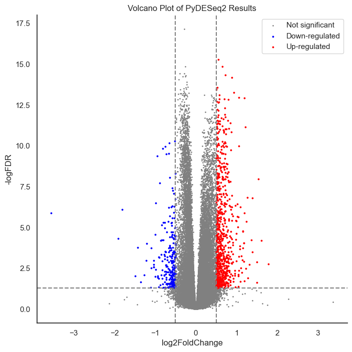
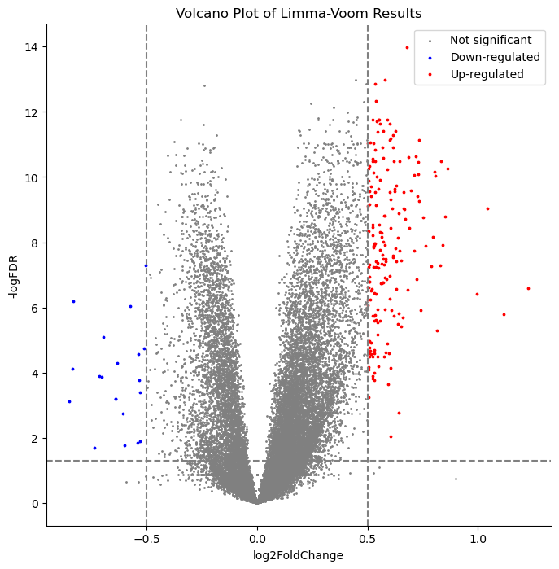
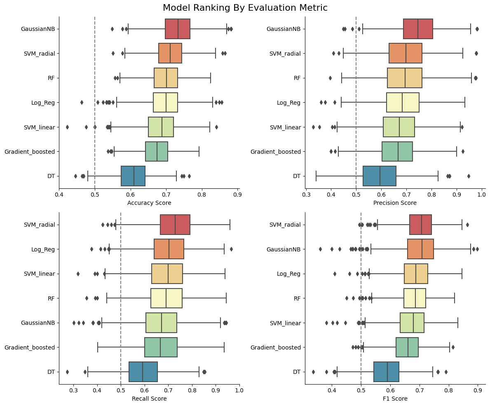
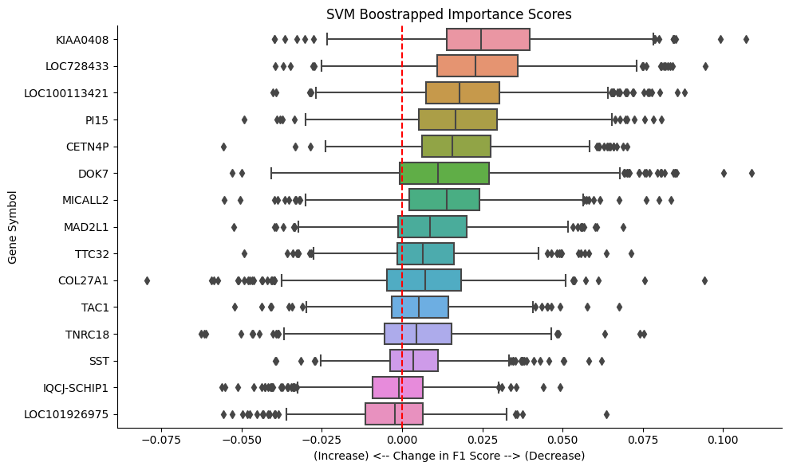
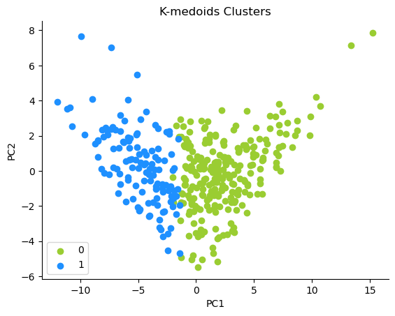
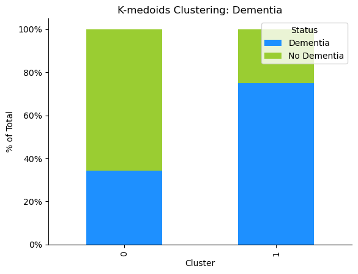
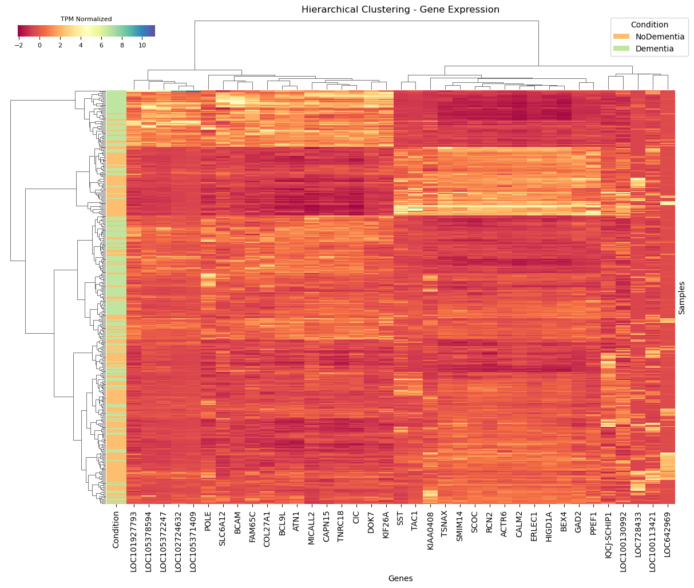
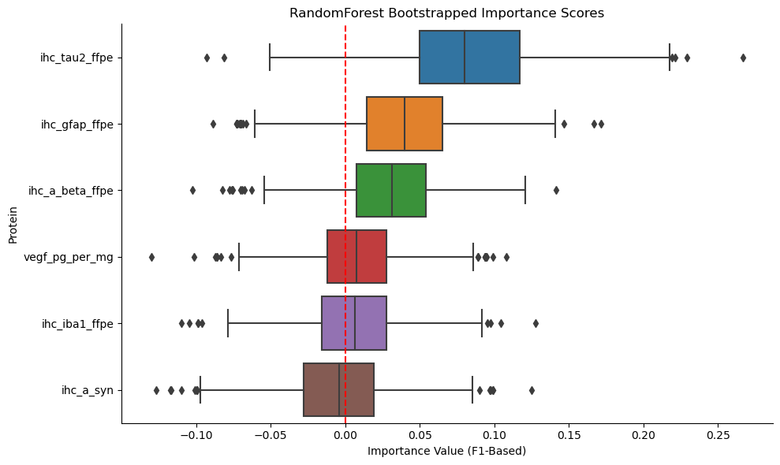

## SIADS Capstone Project - Machine Learning Approaches to Dementia Biomarker Identification

Project Team 21: "The Neuromancers" - Casey Dye, Tony Lan, Camaron Mangham

### Highlights

- 32 genes of interest were selected from 50,281 genes via differential expression analysis of RNA-seq data
- A Support Vector Machine with a radial kernel achieved the highest recall and F1 score on a dementia prediction task
- Several genes stand out as important to model performance: KIAA0408, LOC728433, LOC100113421, CET4NP
- Two sets of the 32 genes were identified to be expressed similarly by hierarchical clustering between samples with dementia and without.
- Protein Analysis confirmed protein feature importance that was consistent with established and emerging literature

### Methods
- RNA-Seq differential expression analysis
- Bootstrapped model evaluation of differentially expressed genes
- Clustering analysis of differentially expressed genes
- Bootstrapped model evaluation of protein quantifications

### Context
Dementia is a condition with major impact across the globe. Dementia encompasses several conditions, with Alzheimer’s disease being the most prevalent form, that affect an individual's daily functioning with notable impact on memory and thinking. Over 55 million people worldwide live with one of these conditions; up to 24 million have Alzheimer’s disease specifically (Mayeux R, et al 2012). A majority of individuals with dementia live in low or middle income countries.

The impacts of dementia are realized in many ways. It is the seventh leading cause of death and a major cause of disability and dependency. Disproportionately affecting women, dementia causes higher disability-adjusted life years and mortality. Additionally, women provide a majority of care for those with dementia. The overall economic impact is estimated to be $1.3 Trillion (Dementia 2023). While there is no known cause of Alzheimer's Disease, the leading hypothesis is that it is caused by a combination of genetic and environmental factors  (Mayeux R, et al 2012). As a higher proportion of the population ages, understanding dementia becomes crucial to reduce the impact it has worldwide.

### Project Statement
Our aim is to further the understanding of dementia. Our current objective is to identify potential biomarkers using machine learning techniques that can be elaborated upon in future studies to combat dementia. To achieve this, we use a combination of bioinformatic and machine learning methods used in previous dementia studies to analyze genomic and proteomic data from the Aging, Dementia and Traumatic Brain Injury (TBI) Study.


### Dataset: Aging, Dementia and Traumatic Brain Injury (TBI) Study
The dataset we will be using for this project was developed by the Allen Institute for Brain Science in consortium with the University of Washington and Kaiser Permanente Washington Health Research Institute. These organizations undertook a longitudinal cohort-based study known as the Adult Changes in Thought (ACT) study (Aging, dementia and Traumatic Brain Injury Study, n.d.). The data used in our analysis comes from a sample within this broader study. This particular group of participants had either experienced at least one traumatic brain injury with loss of consciousness or were part of the similarity-matched control group  (TECHNICAL WHITE PAPER: OVERVIEW 2017). For each participant, a post-mortem autopsy was performed that included dissection and banking of frozen brain tissue from fifteen regions. These tissues were used for immunohistochemistry, in situ hybridization, RNA sequencing, targeted proteomic analysis, quantification of free radical injury, gas chromatography-mass spectrometry, and immunoassays (TECHNICAL WHITE PAPER: QUANTITATIVE DATA GENERATION 2016).

### Data Access Statement
The dataset can be accessed [here](https://aging.brain-map.org/download/index). Some supplementary data is available from the API [here](http://api.brain-map.org).

### How to run this code:

Use requirements_limmavoom_clustering.txt for the following notebooks:
- transform_limmavoom.ipynb
    - For transform_limmavoom.ipynb, to use the function lv_diff_exp(), R must be installed and the file path to the R executable must be passed as a variable.
- clustering.ipynb

Use deseq_gene_ml_requirements.txt for the following notebooks:
- DE_PyDeseq2.ipynb
- gene_ML_1.ipynb
- gene_ML_2.ipynb

Use TL_requirements.txt for the following notebooks:
- Protein_Differential_Expression_TL_FINAL.ipynb
- Protein_Gene_Exploration_TL_FINAL.ipynb
- Protein_Qualitative_Exploration_TL_FINAL.ipynb
- Protein_Quantitative_Exploration_Bootstrap_TL_FINAL.ipynb
- Protein_Quantitative_Exploration_Multicollinearity_TL_FINAL.ipynb
- Protein_Quantitative_Model_Tuning_TL_FINAL.ipynb

### How to get our data

Data in this project was managed with [Data Version Control (DVC).](https://dvc.org/). Once you clone the repo, in your terminal run:

```dvc pull```

## Key Figures

### Gene Selection by Differential Expression of RNA-Seq Counts

To determine differentially expressed genes, we compared two methods used in previous research studies. DESeq2 and limma-voom are two widely used tools in RNA-seq. Both methods compare the change in gene expression across conditions (such as dementia vs no dementia) and also provide adjusted p-values for determining significance. Researchers often compare results from different methods to gain a deeper understanding of gene expression changes in their experiments. Because of this, we used both to identify differentially expressed genes from 50,281 genes.

Genes with an adjusted p-value < .05 and an absolute log fold-change > 0.5 were considered to be differentially expressed to remain consistent with previous work. After filtering, ~1000 and ~200 genes remained for DEseq2 and limma-voom, respectively. The top twenty genes from each analysis were combined, resulting in 32 unique genes for downstream analysis.


<p align="center">
  
  
</p>

### Dementia Classification Models Using Differentially Expressed Genes

Randomly sampled test-train splits exhibited high variability in the feature distribution of the test set. To comprehensively assess the performance of our models, base models were trained over 1000 iterations of random data splits. Evaluation metrics included accuracy, precision, recall, and F1 score.
Among the models, the Gaussian Naive Bayes demonstrated superior accuracy and precision scores. On the other hand, the Support Vector Machine with a radial kernel excelled in recall and F1 score, showcasing its strength in capturing true positive instances, an ideal use case for this dataset.

<p align="center">
  
</p>

A multicollinearity analysis using all 32 genes was conducted, followed by the application of a threshold to generate clusters. A single gene was sampled from each resulting cluster, then the impact of each feature on the overall score was evaluated using the "permutation feature importance" method from the scikit-learn library. The results above focus exclusively on the performance of the Support Vector Machine (SVM) model with a radial kernel, chosen for its best average F1 score.
The analyses identified KIAA0408 and LOC728433 as impactful genes, while LOC100113421 emerged as another strong contender. Surprisingly, the refined set of genes led to a slight improvement in the average precision, F1, and ROC scores for both models on the test sets.

<p align="center">
  
</p>

### Clustering Analysis - Differentially Expressed Genes

We used the most differentially expressed genes to cluster the gene expression profiles of each sample. We compared clustering using K-medoids, HDBSCAN, and K-means, and found that the clusters defined by K-medoids, visualized on the PCA scatterplot  to the right, had the best silhouette score and Davies-Bouldin score.  We also evaluated the clusters’ demographic components and found that cluster 0 had primarily samples with dementia, and cluster 1 had primarily samples that had not had dementia, visualized on the bar graph to the right. More work needs to be done to determine why the samples in unexpected clusters have been placed there.

<p align="center">
  
  
</p>


Hierarchical clustering was performed with z-scores calculated for each column on both the samples and genes and visualized in the clustermap below. When the dendrogram is cut to 4 clusters of samples, one group of samples that are mainly in the dementia group form their own branch. The remaining three clusters do seem to primarily contain samples within the same status of dementia, but are branched together. When the dendrogram is cut to 4 clusters of genes, we can see groupings that exhibit similar expression patterns. This allows us to identify groups of samples and gene expression that are interesting. We can see that, for the clusters that primarily contain dementia samples, there is higher normalized TPM of 'LOC101927793', 'LOC105378594',  'LOC105372247', 'LOC102724632', 'LOC105371409', ''POLE', 'SLC6A12', 'BCAM', 'FAM65C', 'COL27A1', 'BCL9L', 'ATN1', 'MICALL2', 'CAPN15', 'TNRC18', 'CIC', 'DOK7', and 'KIF26A' and lower normalized TPM of 'SST', 'TAC1', 'KIAA0408', 'TSNAX', 'SMIM14', 'SCOC', 'RCN2', 'ACTR6', 'CALM2', 'ERLEC1', 'HIGD1A', 'BEX4', 'GAD2', 'PPEF1'. The pattern is not as clear for the remaining genes, so more work will need to be done to identify why that is.

<p align="center">
  
</p>

### Protein Analysis
The processed protein dataset contained 279 samples with 28 features representing 14 different proteins (or family of proteins). The same machine learning pipeline used to evaluate models for gene analysis were also used for protein analysis. The top performing models were RandomForestClassifier and GradientBoostingClassifier. Since multiple features could be related to a single protein, multicollinearity of features was analyzed. The resulting groups were consistent with expectations.  The 5 amyloid beta proteins were grouped together, and 5 of the 6 Tau related proteins were grouped together. Additionally, all interleukins were also grouped together with other miscellaneous proteins. A threshold of 1 was selected which resulted in 5 features being selected. These 5 features were then used to fit a RandomForest and GradientBoosting classifier, and permutation feature importance was conducted. The feature of most importance for both models was IHC Tau2. This is consistent with current understanding of dementia where accumulation of Tau proteins in the brain is strongly associated with Alzheimer’s Disease.

<p align="center">
  
</p>

### References
1.	(2016). (tech.). TECHNICAL WHITE PAPER: QUANTITATIVE DATA GENERATION. Retrieved December 10, 2023, from https://help.brain-map.org/display/aging/Documentation. 
2.	(2017). (tech.). TECHNICAL WHITE PAPER: OVERVIEW. Retrieved December 10, 2023, from https://help.brain-map.org/display/aging/Documentation. 
3.	Aging, dementia and Traumatic Brain Injury Study. Overview :: Allen Brain Atlas: Aging, Dementia and TBI Study. (n.d.). https://aging.brain-map.org/overview/home 
4.	Mayeux R, Stern Y. Epidemiology of Alzheimer disease. Cold Spring Harb Perspect Med. 2012 Aug 1;2(8):a006239. doi: 10.1101/cshperspect.a006239. PMID: 22908189; PMCID: PMC3405821.
5.	World Health Organization. (2023, March 15). Dementia. World Health Organization. https://www.who.int/news-room/fact-sheets/detail/dementia 
